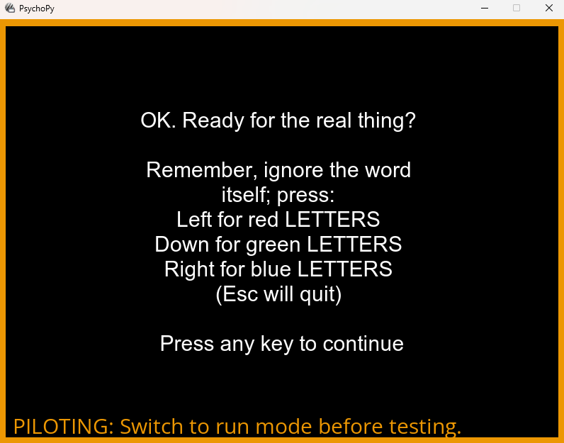

Below are some of the major projects I've worked on with PsychoPy, arranged by the version they were released in.

# Graphical overhaul
[2020.2](https://github.com/psychopy/psychopy/releases/tag/2020.2.0)

One of the first things I did with PsychoPy was a revamp of the user interface. Historically, PsychoPy was developed by volunteers in their free time, so generally took a "function over form" approach out of necessity. Once I was working full-time on PsychoPy I decided to spend some time modernising the look and feel, replacing the default wxPython elements with custom, cleaner designs and replacing the old icons with bespoke vectors.

Below are some before-and-after screenshots of the new look:

### Before

### After

### Now
I've since tried to keep a consistent visual theme with PsychoPy, so this is what the app looks like in 2024:

# Parameter controls
[2021.1](https://github.com/psychopy/psychopy/releases/tag/2021.1.0)

In 2021 I revamped the way that individual parameters in PsychoPy Components are represented, expanding on the standard controls (text, checkboxes, drop down menus) to add controls for files, Excel tables, colour values, multi-line code and others. With this I also worked on improving how these values were interpreted by Builder and written into code, and made template Excel files for parameters which people often struggled to format. This was driven by confusion I'd noticed when supporting students using PsychoPy, who often struggled with what values to put into parameters; do file paths need to be relative? Should colours be in RGB? What does the dollar sign mean?

# Eyetracking
[2021.2](https://github.com/psychopy/psychopy/releases/tag/2021.2.0)

Later in 2021 I worked on adding device-agnostic eyetracking support to PsychoPy, through an existing toolkit called ioHub. ioHub had been supported for some time, but wasn't really visible from the Builder interface. I worked with the author of this package to develop simple Components for adding common eyetracking tasks (starting/stopping the device, calibrating and validating, querying whether participants were looking at a region of interest), which worked the same regardless of what specific device you were using.

# Pavlovia interface
[2022.1](https://github.com/psychopy/psychopy/releases/tag/2022.1.0)

In 2022 I worked on improving how the local PsychoPy app interacted with the Pavlovia servers, making it easier for users to browse and find studies online, and to sync their own experiments to Pavlovia to both run online and share with collaborators.

# Camera support
[2022.2](https://github.com/psychopy/psychopy/releases/tag/2022.2.0)

In the latter part of 2022 we added webcam support - my role in this was to add the Component to Builder and create code for both Python and JavaScript. This meant coordinating across two teams and figuring out, with the needs of both languages, how to make a single unified interface with common parameters to work on both backends.

# Plugins
[2023.1](https://github.com/psychopy/psychopy/releases/tag/2023.1.0)

Plugins were a real paradigm shift for PsychoPy. Previously, in order to support a feature, it had to be added to PsychoPy itself, meaning everyone would get it (and the required packages with it). As PsychoPy got bigger and more capable, this was leading to a problematically large install, so we decided to make PsychoPy pluggable. My role here was to create an interface in the PsychoPy app to pull down a list of known plugins and interact with the backend to install and uninstall them cleanly. I've also since worked a lot on coordinating the various plugin contributors, creating a [plugin template repo](https://github.com/psychopy/psychopy-plugin-template) and have even added [a plugin for making dummy responses when piloting](https://github.com/TEParsons/psychopy-monkeys) myself.

# Routine settings
[2023.2](https://github.com/psychopy/psychopy/releases/tag/2023.2.0)

Traditionally, PsychoPy Routines have been essentially just a list of Component objects. In the latter part of 2023 however I introduced the concept of Routine Settings, allowing users to control parameters of the Routine itself. This meant entire Routines could be disabled for testing, and the whole Routine could have a maximum time (rather than having to infer it from the longest Component). 

# Builder search
[2023.2](https://github.com/psychopy/psychopy/releases/tag/2023.2.0)

As it always goes with programming, the things users really click with aren't the things you spent the most time on. Sometimes a small feature you whip up in a day or two ends up being a game changer; the search box for Builder was one such feature. It's incredibly simple - you just press CTRL/CMD + F and a dialog will appear. Type into that dialog and it will show you where your search term features in Components in your experiment. Nothing programatically difficult, but the impact has been huge! Users with dozens of Routines were previously having to manually sift through them all to find one syntax error or undefined variable in a Code Component, now they can jump right to it by just searching the error text.

# Pilot mode
[2024.1](https://github.com/psychopy/psychopy/releases/tag/2024.1.0)

There are a number of researcher behaviours which are generally good practice, but aren't handled by PsychoPy itself. For example, when building an experiment, it's a good idea to run it in windowed mode so you're not stuck behind a full screen experiment if you hit an error. It's also a good idea to have a verbose logging level when building, but you may not want that many messages when running properly. In 2024 I added a "pilot mode" to PsychoPy, a running mode which tells PsychoPy that the user isn't currently testing and is just trying their experiment out. PsychoPy then knows to do this "good behaviour" - forcing the window out of full screen, increasing logging verbosity, etc.

To make sure users don't accidentally gather data in pilot mode, I also added a big obnoxious orange outline, for safety. Hard to miss, right?

