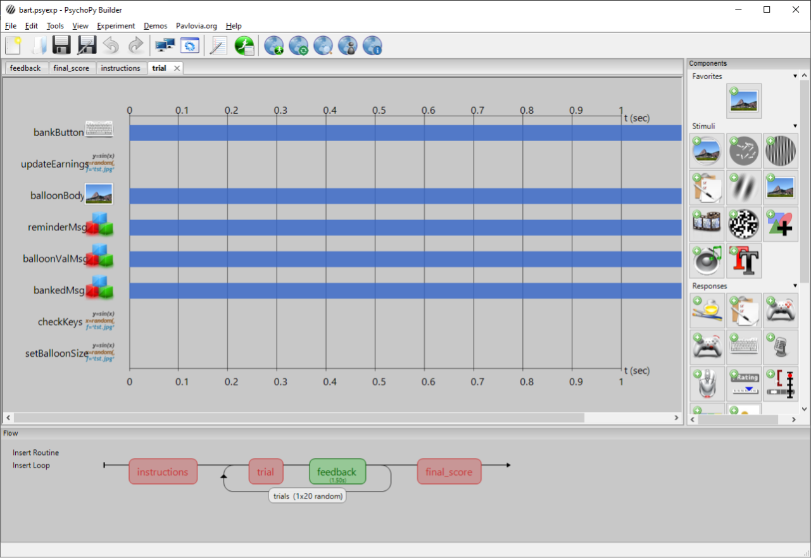

# User Interface

One of the most noticeable changes I've helped to make is a graphical overhaul of the interface; replacing the default wx panels and outdated icons with a clean, navigable and more modern looking interface.

Below are some before-and-after screenshots of the new look:

Before

After