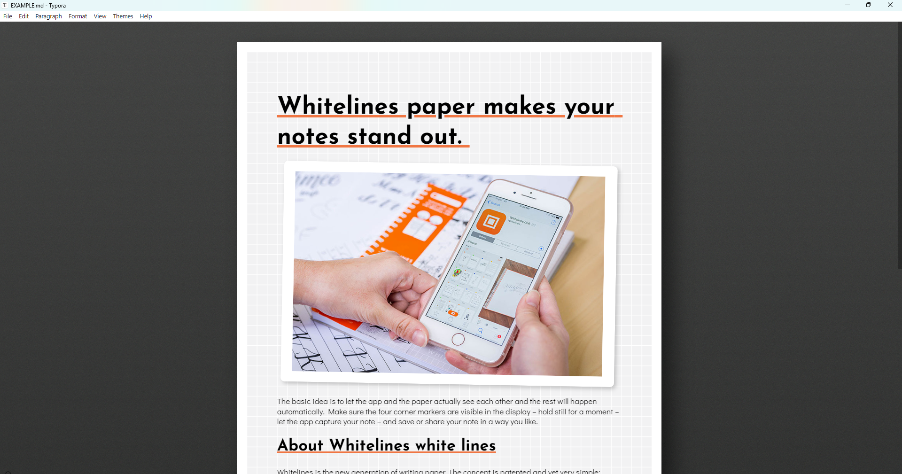

# Who am I?
I'm a Python programmer with a background in psychological research, a hobbyist web / graphic designer, a TTRPG enthusiast, and generally an all round tech nerd.

# PsychoPy

[Psychopy](https://psychopy.org) is Python library and accompanying graphical interface for building psychology experiments, designed to be accurate enough for publication-quality research but intuitive enough for undergraduate students. Since May of 2020, I have been working as a Python developer on PsychoPy - mainly focused on improving the user interface and the way PsychoPy Builder writes Python code.

[Read more...](articles/psychopy/index.md)

# Research

Anyone familiar with video gaming can attest to the physiological response we experience following certain in-game events: a racing heartbeat as you narrowly avoid an enemy attack or sweaty palms as you make a risky play with for a big payoff. Within gaming communities, the term "[sweaty](https://www.urbandictionary.com/define.php?term=Sweaty Tryhard)" is even used as slang for taking the game too seriously.

I'm interested in how our relationship to virtual avatars mediates our physiological reactions to events within a virtual environment; if your avatar takes damage in a video game, do you react differently depending on your relationship to that avatar?

[Read more...](articles/research/index.md)

## Education

@@@
### MSc Psychological Research Methods
**[The University of Lincoln](https://www.lincoln.ac.uk/)**
*September 2017 - December 2019*

Thesis title: 
*How Do Player-Avatar Relationships Mediate Physiological Responses To In-Game Events?*
@@@

@@@
### BSc Psychology, First Class Honors
**[The University of Lincoln](https://www.lincoln.ac.uk/)**
*September 2012 - June 2015*

Dissertation title: 
*Relationships between evolutionary threat and spectral slope.*
@@@

## Publications

[Mather, G., & Parsons, T. (2018). Adaptation reveals sensory and decision components in the visual estimation of locomotion speed. *Scientific reports, 8*(1), 13059](https://doi.org/https://doi.org/10.1038/s41598-018-30230-1)

[Mather, G., Sharman, R. J., & Parsons, T. (2017). Visual adaptation alters the apparent speed of real-world actions. *Scientific reports, 7*(1), 6738.](https://doi.org/10.1038/s41598-017-06841-5)

# Employment

@@@
### Python Developer
**[Open Science Tools Ltd.](https://opensciencetools.org/)**
*Jan 2021 - Present*

Once my contract under the University of Nottingham expired, I was taken on by OST on a permanent basis to continue working on PsychoPy, particularly the user interface.
@@@

@@@
### Python Programmer for Psychopy
**[The University of Nottingham](https://www.nottingham.ac.uk/)**
*May 2020 - Jan 2021*

I was hired under a CZI grant to help improve the stability of PsychoPy around the 2020.2 and 2021.1 releases.
@@@

@@@
### Psychology Technician
**[The University of Lincoln](https://www.lincoln.ac.uk/)**
*January 2017 - May 2020*

As a technician, I assisted staff and students with a variety of technical issues. In particular, scripting in Matlab, creating graphical resources and managing an online research presence.
@@@

@@@
### Research Assistant
**[The University of Lincoln](https://www.lincoln.ac.uk/)**
*April 2016 - December 2016*

In 2016 I was employed by [Professor George Mather](https://gmresearch2016.blogs.lincoln.ac.uk/) at the University of Lincoln as a research assistant, assisting with the final year of a collaboration between himself and Doctor Rebecca Sharman, looking at early visual processing of [human locomotion](https://www.tandfonline.com/doi/abs/10.1080/14786443408648481").
@@@

## Awards
@@@
### Technical Support in Psychology Research Award
**From:** British Psychological Society, July 2020
**To:** Psychology Technician Team (University of Lincoln)

> We are so proud of our amazing technicians [@PsychTechnician](https://twitter.com/PsychTechnician) who won the Technical Support in Psychology Award from the BPS! [@BPSOfficial](https://twitter.com/BPSOfficial)
> Well done, and thank you for all your hard work! [buff.ly/3ei5JeA](https://buff.ly/3ei5JeA)
> [#psychlincs](https://x.com/hashtag/psychlincs) [@bydhifu](https://twitter.com/bydhifu) [@ManOCheese](https://twitter.com/ManOCheese) [@ToddEParsons](https://twitter.com/ToddEParsons) [@___charl](https://twitter.com/___charl)

- *[@PsychLincoln via X](https://x.com/PsychLincoln/status/1282585568032030720)*
@@@

@@@
### Team Achievement Award: Best Achievement In Customer Service
**From:** University of Lincoln, December 2019
**To:** Psychology Technician Team

> Congratulations to our [#psychlincs](https://x.com/hashtag/psychlincs) [#UoLSMA19](https://x.com/hashtag/UoLSMA19) winners yesterday! 
> [@thisdrkmckenzie](https://twitter.com/thisdrkmckenzie) (Best Practice), [@LMarechal_](https://twitter.com/LMarechal_) & Dr Ava Horowitz (Individual Merit), [@kayritchiepsych](https://twitter.com/kayritchiepsych) (Vice Chancellor's), #pint18lincoln (Public Engagement) and [@PsychTechnician](https://twitter.com/PsychTechnician) (Team Achievement)! 
> Phew, what a list!

- *[@PsychLincoln via X](https://x.com/PsychLincoln/status/1197477709896716288)*
@@@

## Professional memberships
@@@
### University and College Union (UCU)
**Member**
*January 2017 - Present*
@@@

@@@
### University of Lincoln School of Psychology Equality Committee (SPEC)
**Technician Representative, LGBTQI+ Champion**
*January 2017 - May 2020*

For more information on the School of Psychology Equality Committee, please see the [SPEC website](https://spec.blogs.lincoln.ac.uk).
@@@

@@@
### Association of Technical Staff in Psychology (ATSiP)
**Member**
*January 2017 - May 2020*

For more information on the Association of Technical Staff in Psychology, please see the [ATSiP website](https://atsip.ac.uk).
@@@

@@@
### University of Lincoln Perception, Action & Cognition (PAC) Research Group
**Member**
*April 2016 - May 2020*

For more information on the Perception, Action & Cognition group at Lincoln, please see the [PAC group website](https://pacgroup.blogs.lincoln.ac.uk/).
@@@

# Other Projects

## CSS Themes
As you may be able to tell from this website, I enjoy making CSS themes. It gives me an outlet for my inherent aesthetic snobbery, I find it relaxing making minor tweaks to the spacing of such-and-such element to get a page rendering exactly how I want it.

### Torillic

Torillic is designed to look like the official material for Dungeons & Dragons, I use it to write notes for my TTRPG campaigns and to style them once compiled and hosted to wiki-style websites.

[Read more...](articles/torillic/index.md)

### LCARS

LCARS is designed to look like the fictional LCARS operating system from Star Trek. Like Torillic, I like to use it for TTRPG campaign notes, but in this case the more sci-fi adjacent settings.

### Whitelines

Whitelines is the theme I use most in my day-to-day markdown editing. It's designed to look like [Whitelines](https://www.whitelinespaper.com/) notepads, which (being a stationery nerd) are my favourite kind of notebook to write on. So it only makes sense to edit markdown on the same kind of paper!

## Python GUI

Working with a Python-based graphical user interface (GUI) at Open Science Tools gives me a thorough familiarity with the GUI packages used in Python, sometimes I find myself wishing for certain widgets to exist so in my free time I go ahead and make them.

### `pygments-gui`
`pygments-gui` is a plugin for [Pygments](https://pygments.org/), a Python package which takes code and applies syntactic styling to it. The plugin adds classes and methods for using Pygments within a GUI, styling the contents of text controls live in a fast and efficient way.

You can find `pygments-gui` on GitHub [here](https://github.com/TEParsons/pygments-gui).
