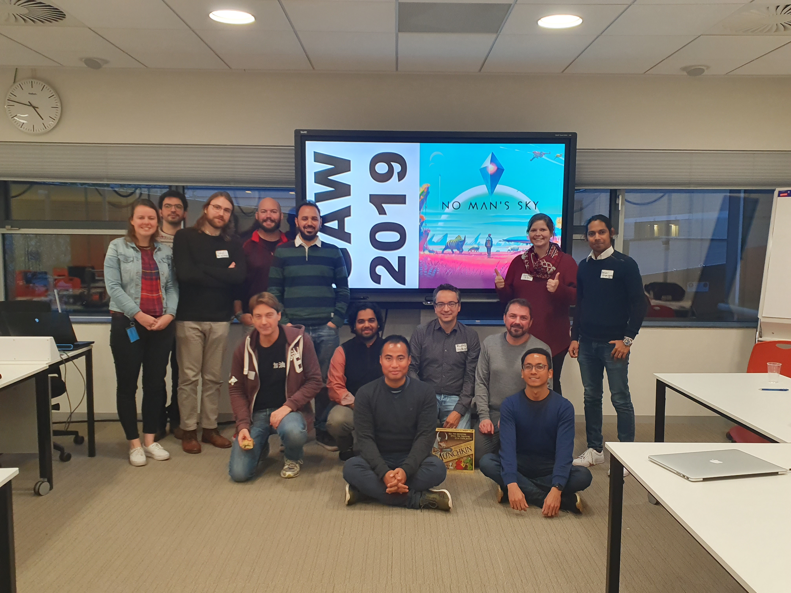

I attended GAW in 2019, hosted that year by [TU Delft](https://www.tudelft.nl/). The game in question that year was [No Man's Sky](https://store.steampowered.com/app/275850/No_Mans_Sky/); an open-world, procedurally-generated survival game in which you play as a stranded explorer on a hostile planet, slowly gaining new technologies and eventually blasting off to explore the galaxy.

My research looks at players' biological responses to in-game events, and how these can be modulated by their relationship to their avatar. So I had brought with me a [Neulog Edulogger](https://edulab.com/datalogging/) to measure GSR during gameplay, which I ran in MATLAB 2019, using [code](https://github.com/UniLincolnPsychTech/Edulog) I had written in my role as a technician. This footage is from myself playing No Man's Sky, with my Galvanic Skin Response (GSR) data from the same time - both tonic (gradual) and phasic (immediate) - overlaid for side-by-side comparison.

<iframe width="100%" height="480px" src="https://www.youtube.com/embed/38E3a91dfws" frameborder="0" allow="accelerometer; autoplay; encrypted-media; gyroscope; picture-in-picture" allowfullscreen=""></iframe>

Footage from the workshop. I'm playing No Man's Sky whilst measuring my GSR.

